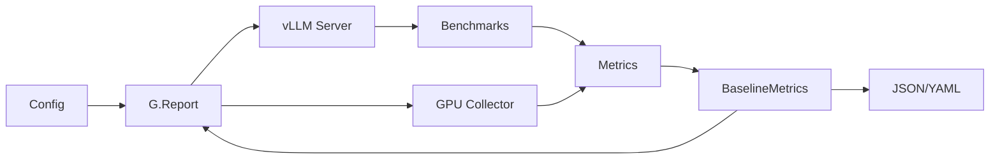

# Baseline Integration Architecture

## Flow Diagram

## Implementation Phases

### Phase 1: Config Updates
- BaselineConfig class in config/models.py
- Added baseline parameters to WorkloadConfig

### Phase 2: Core Components
- BaselineMetrics dataclass
- VLLMBaselineRunner class
- GPU monitoring integration

### Phase 3: CLI Integration
- `--baseline` flag in tune command
- Automatic baseline generation before optimization

### Phase 4: Report Integration
- Baseline data loading in HTML report generator
- Baseline comparison table in reports
- Improvement calculations

## See Also

- [Tuning Engine](tuning-engine.md) - How optimization works
- [Baseline Comparison](../user-guide/reports/baseline-comparison.md) - Using baseline in reports
