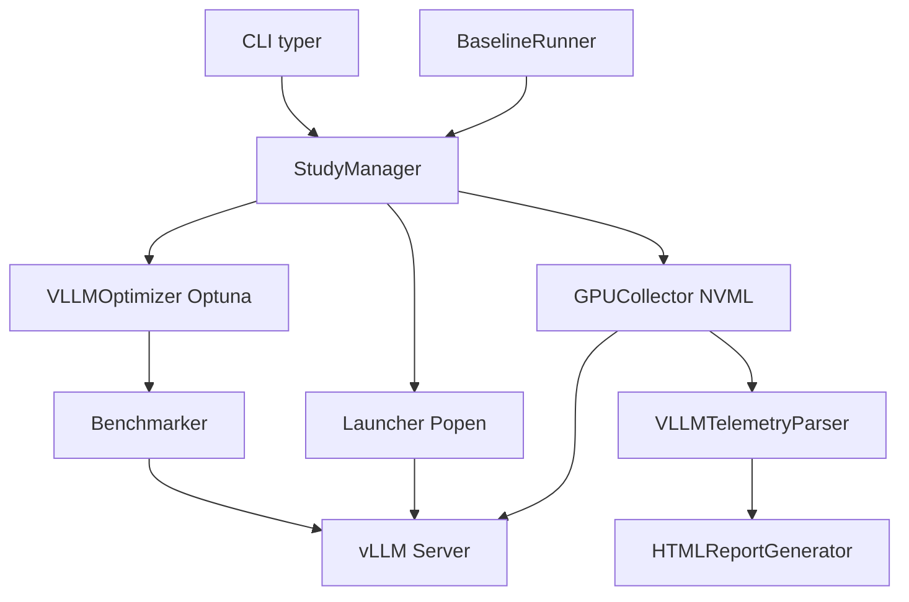

# Architecture

## Overview

vLLM-Tuner consists of several coordinated components:

## Components

### CLI Layer (src/cli/)
- `main.py` - Typer CLI interface
- Commands: tune, report, export, list-studies

### Configuration (src/config/)
- `models.py` - Pydantic validation models
- `validation.py` - YAML parsing and validation

### Tuning Engine (src/tuner/)
- `study_manager.py` - Study orchestration
- `optimizer.py` - Optuna optimization logic

### Integration (src/)
- `vllm/launcher.py` - vLLM server launch
- `vllm/telemetry.py` - vLLM log parsing
- `baseline/runner.py` - Baseline generation

### Profiling (src/profiling/)
- `gpu_collector.py` - NVML GPU monitoring
- `vllm_metrics.py` - vLLM performance metrics

### Reporting (src/reporting/)
- `html.py` - HTML report generation
- `export.py` - Configuration export

## See Also

- [Baseline Integration](baseline-integration.md) - Baseline system architecture
- [Tuning Engine](tuning-engine.md) - How optimization works
