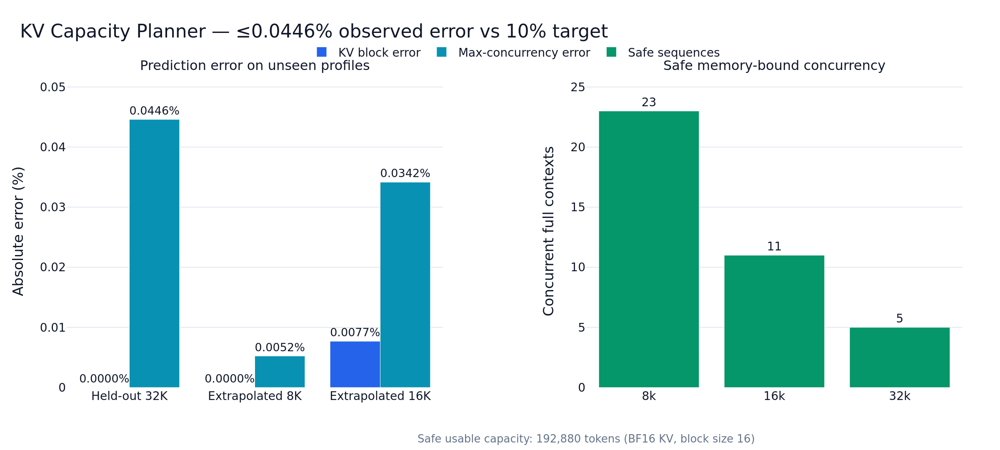
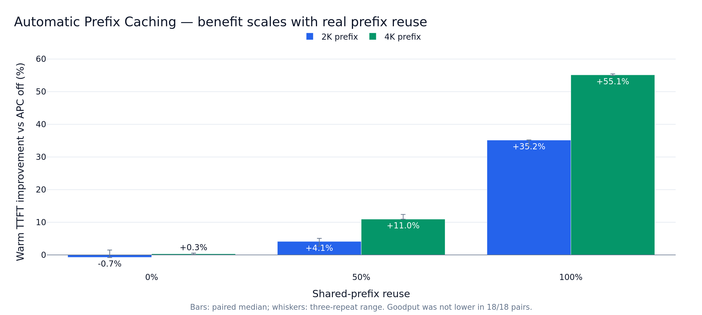
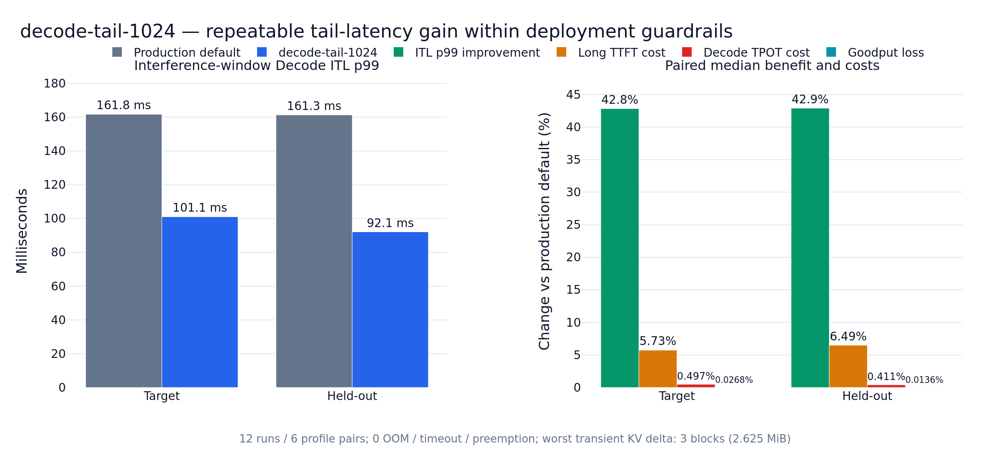

# Long-context v5: sealed result snapshot

This page is the checked-in, human-readable index for the long-context v5 evidence. Numbers come
from sealed data-disk summaries, not from console output, smoke extrapolation, a best single run,
or the legacy 3B/TPE project line.

## Scope and identity

| Item | Frozen value |
|---|---|
| Model | `Qwen/Qwen2.5-7B-Instruct` |
| Model/tokenizer revision | `a09a35458c702b33eeacc393d103063234e8bc28` |
| Parameters | 7,615,616,512 |
| GPU | NVIDIA GeForce RTX 5090, 32,607 MiB, compute capability 12.0 |
| vLLM | 0.16.0, upstream commit `89a77b10846fd96273cce78d86d2556ea582d26e` |
| Runtime | Python 3.12.3; PyTorch 2.9.1+cu130; CUDA 13.0; driver 595.71.05 |
| Parallelism | One GPU, TP=PP=1 |
| Runtime boundary | Clean upstream Scheduler; no SLOTune Scheduler patch in M1–M5 |

The model lock includes size and SHA-256 for every model/tokenizer file. The runtime lock includes
the wheel record and selected upstream source hashes. Both are under
[`experiments/long_context/v5/`](../../experiments/long_context/v5/).

## Evidence register

| Evidence | Measurement/analysis commit | Status | Root integrity SHA-256 |
|---|---|---|---|
| M1 Planner initialization validation | `b76e626` | PASS | `4aec115c…6a39c` |
| M1 formal capacity sweep | `e38ef62` | 27/27 runs complete; v1 boundary definition retained as negative | `00693756…c62` |
| M1 capacity boundaries v2 | `2b38ad1` | PASS; zero GPU reruns, numeric thresholds unchanged | `ba9f697d…fa42` |
| M2 FP8 final compatibility smoke | `8c4f872` | INCOMPATIBLE; formal matrix prohibited | `9385b0ba…c41e` |
| M3 APC formal | `3ac887c` | 20/20 PASS | `e88dd3da…3b36` |
| M4 Chunked Prefill formal | `f3e78b4` | 18/18 PASS; selection remains production default | `9ebc24b2…4046` |
| M5 original formal | `9ec3369` | 12/12 complete; original strict KV gate rejected target | `4f224fd4…c4c2` |
| M5 engineering reanalysis | `5a94207` | PASS; `decode-tail-1024`, zero GPU reruns | `43a7016b…708e` |

The abbreviated hashes above identify the root integrity files. Exact artifact paths appear in
the [artifact-path register](#artifact-path-register).

## M1 — independently implemented KV Capacity Planner

The Planner derives per-token/per-block KV geometry from layer count, K/V, KV heads, head
dimension, dtype, and block size. It then accounts for the vLLM null block, page rounding,
checkpoint bytes, a calibrated runtime residual, and explicit fixed/proportional safety reserves.

Calibration used two repeats each at `gpu_memory_utilization` 0.75, 0.80, and 0.85. The inferred
non-KV point estimate was 18,376,753,152 bytes. None of the three validation profiles contributed
to that calibration.

| Validation | Predicted / observed blocks | Predicted / observed cached tokens | Predicted / observed full-context concurrency | Absolute block error | Absolute concurrency error |
|---|---:|---:|---:|---:|---:|
| Held-out util=0.90, 32K | 12,999 / 12,999 | 207,984 / 207,984 | 6.3472 / 6.35 | 0% | 0.0446% |
| Extrapolated 8K profile | 12,999 / 12,999 | 207,984 / 207,984 | 25.3887 / 25.39 | 0% | 0.0052% |
| Extrapolated 16K profile | 12,999 / 12,998 | 207,984 / 207,968 | 12.6943 / 12.69 | 0.0077% | 0.0342% |

All values passed the preregistered 10% target. With a 256 MiB fixed operational reserve plus 5%
proportional KV reserve, the deployment plan exposed 12,055 usable blocks/192,880 usable tokens:
23 complete 8K contexts, 11 complete 16K contexts, or 5 complete 32K contexts. These are
memory-safe concurrency bounds, not throughput knees.



### Service and saturation boundaries

The sealed v1 capacity reducer required every context to expose one combined knee and therefore
rejected 16K/32K, even though all 27 formal runs completed. The v2 zero-GPU analysis preserved
every numeric threshold and the v1 negative result, but separated the production SLO boundary
from the mechanism-level joint-overload boundary:

| Context | Last SLO-stable / first SLO breach | Pre-saturation / first joint overload |
|---|---|---|
| 8K | mid 1 rps / high 2 rps | mid 1 rps / high 2 rps |
| 16K | low 0.4 rps / mid 0.5 rps | mid 0.5 rps / high 1 rps |
| 32K | left-censored below low 0.2 rps | mid 0.25 rps / high 0.5 rps |

This distinction prevents a safe memory bound from being confused with an SLO service rate.

## M2 — FP8 incompatibility is a result, not a missing chart

The BF16 control completed. The selected `fp8_e5m2`/`TRITON_ATTN` profile entered vLLM's FP8 KV
configuration but failed during engine profiling before readiness. The preserved stack ends at:

```text
torch._dynamo.exc.Unsupported: Data-dependent assertion failed
attention.py: assert self.kv_cache_dtype in {"fp8", "fp8_e4m3"}
```

The checkpoint also had no calibrated FP8 scale keys. Consequently, the paired capacity and
quality matrix is empty: there is no honest basis for an FP8 capacity, latency, or quality claim.
M3–M5 did not retry FP8, silently fall back, or convert the BF16 control into FP8 evidence.

## M3 — Automatic Prefix Caching

The 18 core runs crossed APC off/on with 2K/4K real RAG prefixes and 0/50/100% reuse. Each cell
used three paired repeats; two additional preregistered runs measured the prefix-pool boundary.

| Prefix | Reuse | Warm TTFT improvement, paired median (range) | Warm token-hit ratio | Goodput not lower |
|---:|---:|---:|---:|---:|
| 2K | 0% | -0.7% (-0.8% to +1.5%) | 0% | 3/3 |
| 2K | 50% | 4.1% (2.7% to 5.1%) | 12.70% | 3/3 |
| 2K | 100% | 35.2% (33.4% to 35.2%) | 25.40% | 3/3 |
| 4K | 0% | 0.3% (0.1% to 0.6%) | 0% | 3/3 |
| 4K | 50% | 11.0% (10.9% to 12.4%) | 25.40% | 3/3 |
| 4K | 100% | 55.1% (55.0% to 55.5%) | 50.79% | 3/3 |



The 0% controls had zero cache hits and near-zero TTFT movement. The measured token-hit ratio is
lower than the request reuse percentage because the counter includes the uncached portion of each
prompt. Goodput was not lower in all 18 paired comparisons.

For the 4K prefix-pool boundary, the predicted resident-prompt count was 56. A pool of 48 retained
48/48 full hits and a 98.46% token-hit ratio. A pool of 72 exposed the first full miss at probe 55,
with 54 full hits, one partial hit, 17 misses, and a 75.18% overall token-hit ratio. This is the
measured eviction/capacity boundary; APC is not claimed to have unbounded warm-cache benefit.

## M4 — Chunked Prefill calibration kept production default

M4 injected 4K/8K Long Prefills into a stable Decode stream and compared the real upstream
production default with native thresholds 1024 and 512.

| Candidate | Long Prefill | ITL improved | Decode Goodput not lower | Preemptions not higher |
|---|---:|---:|---:|---:|
| threshold 1024 | 4K | 3/3 | 3/3 | 3/3 |
| threshold 1024 | 8K | 3/3 | 1/3 | 3/3 |
| threshold 512 | 4K | 3/3 | 3/3 | 3/3 |
| threshold 512 | 8K | 3/3 | 0/3 | 3/3 |

The pooled median interference-window ITL p99 improvements were 41.5% for 1024 and 57.1% for
512. At 8K, however, the per-repeat Decode Goodput changes ranged from +0.0018% to -0.0114% for
1024 and -0.0025% to -0.0213% for 512. The preregistered rule was direction-only and had zero
tolerance, so neither candidate was eligible and the sealed selection remained
`production-default`. M5 uses M4 as calibration evidence; it does not rewrite that selection.

## M5 — `decode-tail-1024` deployment decision

M5 froze exactly two profiles: upstream `production-default` and `decode-tail-1024`
(`enable_chunked_prefill=true`, `long_prefill_token_threshold=1024`). Target and held-out each used
three paired repeats with identical within-pair traces; held-out changed prompt/arrival seeds and
the workload composition or injection timing.

| Cohort | Decode ITL p99 improvement | Decode Goodput change | Long Prefill TTFT p99 cost | Decode TPOT p99 cost |
|---|---:|---:|---:|---:|
| Target | 42.834% (36.337% to 68.749%) | -0.0268% (-0.0289% to -0.0219%) | +5.731% (-16.298% to +7.418%) | +0.497% (-0.006% to +0.663%) |
| Held-out | 42.899% (42.515% to 43.123%) | -0.0136% (-0.0279% to -0.0012%) | +6.493% (+6.352% to +8.521%) | +0.411% (+0.394% to +0.451%) |



Engineering acceptance required paired-median ITL improvement ≥25%, Goodput change ≥-0.5% with
every repeat ≥-1%, Long TTFT cost ≤15%, Decode TPOT cost ≤2%, non-worse paired-median peak
waiting, zero OOM/timeout/preemption, and no material KV increase. Both cohorts passed every rule.

### Original formal negative and versioned engineering analysis

The original formal reducer treated any positive median of a single-sample KV maximum as a
deployment failure. Two target repeats observed a transient maximum of three extra blocks out of
14,614 usable blocks, so that sealed artifact selected `production-default`.

The independent engineering analysis did not alter or delete the formal root and did not rerun
the GPU. It replaced only that mechanism statistic with a materiality limit: paired-median KV p95
and every-repeat peak delta must stay within 0.1 percentage point of usable KV capacity. The
observed worst delta was 0.02053 percentage point/2.625 MiB; target paired-median KV p95 was
identical, peak waiting improved by one request, and all reliability counts remained zero. This
separate artifact therefore selected `decode-tail-1024` for the stated workload.

## Claim boundary

- `decode-tail-1024` is a native vLLM configuration, not a custom scheduling algorithm.
- APC and Chunked Prefill were used and analyzed; neither was authored in this repository.
- Planner validation is exact for the locked environment and does not establish cross-model or
  cross-GPU calibration transfer.
- APC improves reusable Prefill work/TTFT; it does not directly accelerate each Decode token.
- M4 remains a retained production-default selection under its original rule.
- M2 is a retained compatibility failure. No FP8 benefit is claimed and no retry is authorized on
  the frozen stack.
- M5 reports all repeats and held-out results. The 42.8%/42.9% figures are paired medians, not the
  best runs.

## Artifact-path register

```text
/root/autodl-tmp/longctx-v5-artifacts/longctx-v5-m1-planner-init-002
/root/autodl-tmp/longctx-v5-artifacts/longctx-v5-m1-capacity-formal-001
/root/autodl-tmp/longctx-v5-artifacts/longctx-v5-m1-capacity-formal-001-boundaries-v2
/root/autodl-tmp/longctx-v5-artifacts/longctx-v5-m2-fp8-smoke-004
/root/autodl-tmp/longctx-v5-artifacts/longctx-v5-m3-apc-formal-001
/root/autodl-tmp/longctx-v5-artifacts/longctx-v5-m4-chunked-formal-001
/root/autodl-tmp/longctx-v5-artifacts/longctx-v5-m5-decode-tail-formal-001
/root/autodl-tmp/longctx-v5-artifacts/longctx-v5-m5-decode-tail-engineering-001
```

The original M5 formal source contains every trace, per-request record, server command/log,
Prometheus/NVML series, cleanup record, per-trial integrity anchor, and all 12 trial summaries.
The engineering root contains only a sealed derived analysis and points back to the original
integrity hash.
