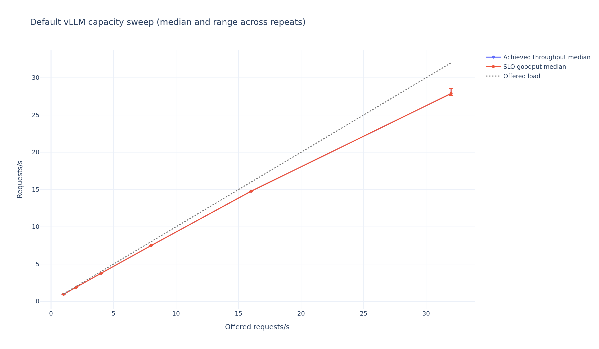
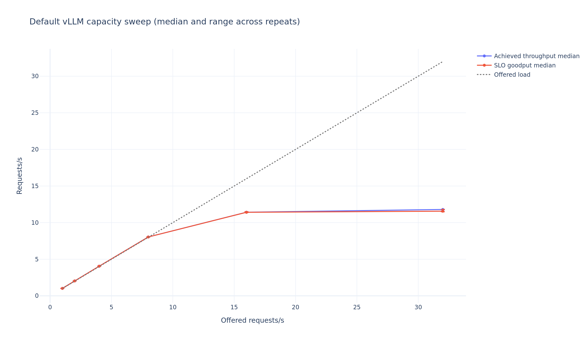

# Qwen2.5-3B formal evidence snapshot

This is the checked-in, human-readable index for two completed formal GPU artifacts. The raw
requests, telemetry, logs, Parquet aggregates, interactive reports, and integrity records remain
on the data disk; this page copies only the results needed to audit the claim boundary.

## Provenance

| Field | Recorded value |
|---|---|
| Measurement commit | `34a25a2e10951bfab1c2a86b4c60aff5bef785df` |
| Measurement tree | clean; source-tree SHA-256 `407309b939d944f524d4afaf7136a05303d52b48a6889d9e9791e0128d2b06b4` |
| Model | local `Qwen2.5-3B-Instruct` |
| Model weights SHA-256 | `a70aaede3c09d599f1a632a254012408371a1cd36175062f4eed1343c7fae549` |
| Tokenizer SHA-256 | `aa669c9a419bc0ed6a6d34ae06a57772a342e1e7496a63764c1171c9a577dd28` |
| GPU | NVIDIA GeForce RTX 5090, 32,607 MiB |
| Runtime | Python 3.12.3; vLLM 0.16.0; PyTorch 2.9.1+cu130; CUDA runtime 13.0; driver 595.71.05; Transformers 4.57.6; NumPy 2.2.6 |
| Backend | SLOTune SSE frozen-trace replay; fixed 128 output tokens, EOS ignored |
| Chat search trace SHA-256 | `89e5d6f9e505f72aec5594323c4fc6f3e35ed5c0fa7d7927d4d1b1ff63b1c6b9` |
| Chat holdout trace SHA-256 | `aac7760903a8c609756fbead137a694065dd8c1193081e97f6884653c0200b84` |
| RAG search trace SHA-256 | `d92f7fc83a04e57aaa424ef9da1e92ecd40f33fe00247f45dde75583f3af0c57` |
| RAG holdout trace SHA-256 | `f13d91219e7d18f15c5fcb5f4d2f00f138ac1c39ba124717849277c52322c1fd` |
| Search | 16 measured trials each for default, seeded random, and constrained TPE |
| Validation | five candidates × three repeats and five candidates × three held-out repeats |
| Capacity | nominal 1/2/4/8/16/32 requests/s, three repeats per point, vLLM defaults only |

The measurement commit is the provenance of the numbers. Any later repository revision used to
generate the additive root attestation or this page is recorded separately by the attestation; it
does not rewrite the sealed trials or change the measurement commit.

## Evidence roots

- Chat: `/root/autodl-tmp/slotune-results/qwen25-3b-chat-formal-34a25a2`
- RAG: `/root/autodl-tmp/slotune-results/qwen25-3b-rag-formal-34a25a2`
- Live official/SSE check:
  `/root/autodl-tmp/slotune-results/cross-validation-34a25a2-20260816`
- Current 0.6B smoke:
  `/root/autodl-tmp/vllm-tuner-output/slotune-results/smoke-34a25a2-20260816`

Each formal root contains 96 terminal trials: 48 search, 15 repeat, 15 holdout, and 18 capacity.
The audit found 89 COMPLETE and seven constraint-INFEASIBLE trials in each workload, with no
FAILED or PRUNED trial. All 48,000 measured requests per workload completed successfully; an
INFEASIBLE result below means the completed measurement violated a configured latency or memory
constraint, not that requests failed.

## Arrival-rate interpretation

The YAML `request_rate` is the target parameter of the seeded gamma-arrival generator. A finite
500-request trace has a different empirical rate, calculated from its persisted scheduled
offsets:

| Workload | YAML target | Search-trace empirical | Holdout-trace empirical |
|---|---:|---:|---:|
| Chat | 8.000 req/s | 8.029529 req/s | 8.456300 req/s |
| RAG | 4.000 req/s | 4.254534 req/s | 4.331800 req/s |

This distinction explains why a measured goodput can be slightly above the YAML target: it is not
above the realized arrival rate. Capacity tables retain the nominal sweep label and report the
separately computed empirical scheduled rate and measured achieved rate. In current artifacts,
legacy `measured_offered_requests_per_sec` is a target-rate alias, not an empirical measurement;
the additive experiment audit records that compatibility boundary explicitly.

## Tuning outcome

The preregistered project success condition was at least 15% more goodput at the same SLO, or at
least 20% lower p99 TTFT at the same goodput. Neither workload met it.

### Chat

SLO: p99 TTFT ≤800 ms, p99 TPOT ≤80 ms, p99 E2E ≤6,000 ms, error rate ≤1%, peak
VRAM ≤31,000 MiB, and memory utilization ≤0.95.

Strict repeat/holdout selection chose `tpe-11`
(`gpu_memory_utilization=0.7857917`, `max_num_batched_tokens=4096`, `max_num_seqs=16`,
TP=PP=1). The differences from the repeated default were much smaller than the success
thresholds:

| Phase | Candidate | Goodput median (range), req/s | p99 TTFT median (range), ms | Versus default |
|---|---|---:|---:|---|
| Repeat | default-1 | 7.947565 (7.947024–7.948000) | 63.636 (59.498–89.752) | reference |
| Repeat | tpe-11 | 7.948109 (7.946653–7.948135) | 61.366 (60.760–62.801) | +0.0068% goodput; 3.57% lower TTFT |
| Holdout | default-1 | 8.359356 (8.359333–8.361196) | 62.023 (58.222–68.858) | reference |
| Holdout | tpe-11 | 8.360697 (8.360585–8.360846) | 62.348 (61.320–62.411) | +0.0160% goodput; 0.52% higher TTFT |

Five Chat search trials violated the 800 ms TTFT constraint and two violated the memory
constraint. Every one still completed 500/500 measured requests, so the seven outcomes are
correctly classified as constraint-INFEASIBLE rather than request failures.

### RAG

SLO: p99 TTFT ≤1,500 ms, p99 TPOT ≤100 ms, p99 E2E ≤10,000 ms, error rate ≤1%, peak
VRAM ≤31,000 MiB, and memory utilization ≤0.95.

The default remained the selected result. `tpe-5` illustrates why the honest conclusion is a
negative tuning result: repeated goodput was 0.0013% lower and held-out goodput only 0.0141%
higher than default; p99 TTFT was 7.54% lower on repeats and 8.49% lower on holdout, still below
the 20% threshold.

| Phase | Candidate | Goodput median (range), req/s | p99 TTFT median (range), ms | Validation |
|---|---|---:|---:|---|
| Repeat | default-0 | 4.227418 (4.225570–4.227453) | 337.028 (324.425–339.307) | 3/3 feasible |
| Holdout | default-0 | 4.311275 (4.310998–4.311678) | 431.624 (429.350–495.945) | 3/3 feasible; holdout/repeat ratio 1.019836 |

Four RAG search trials violated the VRAM/memory-utilization constraint, one search trial narrowly
violated the TTFT constraint at 1,501.335 ms, and two nominal-32 capacity repeats violated TTFT.
All seven completed 500/500 measured requests.

## Capacity

### Chat capacity is a lower bound

All 18 Chat capacity trials were COMPLETE and feasible. At the highest tested point, the median
achieved rate and goodput were both 27.883 req/s with median p99 TTFT 144.274 ms. The experiment
therefore establishes only a default-configuration capacity lower bound of at least 27.883 req/s
under this trace and SLO; it does not locate a saturation knee or justify extrapolation beyond the
32 req/s nominal point.

| Target offered req/s | Empirical scheduled req/s | Feasible | Median achieved/goodput req/s | Median p99 TTFT ms |
|---:|---:|---:|---:|---:|
| 1 | 0.944593 | 3/3 | 0.945 / 0.945 | 52.866 |
| 2 | 1.889186 | 3/3 | 1.888 / 1.888 | 54.084 |
| 4 | 3.778373 | 3/3 | 3.763 / 3.763 | 58.561 |
| 8 | 7.556746 | 3/3 | 7.478 / 7.478 | 60.503 |
| 16 | 15.113492 | 3/3 | 14.770 / 14.770 | 60.391 |
| 32 | 30.226983 | 3/3 | 27.883 / 27.883 | 144.274 |

### RAG capacity shows a knee

The observed default-configuration knee is near the nominal 16 req/s point. Achieved throughput
then plateaus around 11.8 req/s; at nominal 32 req/s only one repeat remains feasible, while two
of three repeats are INFEASIBLE because p99 TTFT exceeds 1,500 ms.

| Target offered req/s | Empirical scheduled req/s | Feasible | Median achieved/goodput req/s | Median p99 TTFT ms |
|---:|---:|---:|---:|---:|
| 1 | 1.018862 | 3/3 | 1.019 / 1.019 | 221.6 |
| 2 | 2.037723 | 3/3 | 2.034 / 2.034 | 251.6 |
| 4 | 4.075447 | 3/3 | 4.051 / 4.051 | 340.0 |
| 8 | 8.150893 | 3/3 | 8.037 / 8.037 | 525.7 |
| 16 | 16.301787 | 3/3 | 11.423 / 11.412 | 1,179.6 |
| 32 | 32.603574 | 1/3 | 11.797 / 11.561 | 1,728.7 |

The corresponding TTFT–goodput plots are [Chat](chat-pareto.png) and
[RAG](rag-pareto.png).

## Scheduler simulator negative result

The scheduler records embedded in the experiment reports are deterministic CPU simulator output,
not an adaptive vLLM runtime experiment. Adaptive delivered exactly 0% goodput gain over the best
fixed budget on both calibration and held-out traces. Its p99 TTFT was worse than the best fixed
budget:

| Workload | Calibration | Held-out |
|---|---:|---:|
| Chat | 25.36% worse | 15.58% worse |
| RAG | 167.22% worse | 332.79% worse |

This is a retained no-benefit/regression result. It supports the simulator's downside-reporting
and fairness mechanisms, but makes no GPU scheduler speedup claim. Runtime scheduler integration
remains deferred.

## Official-vs-SSE cross-check

The Qwen3-0.6B live cross-check at measurement commit `34a25a2` completed the same two prompts
through the official adapter and SLOTune SSE path. Completed/failed counts and total input/output
tokens matched; SSE token timestamps were valid. The backends were run sequentially and the
official tool generates arrivals independently, so the recorded latency ratios are only a
unit/order-of-magnitude sanity check, not a performance-equivalence claim.

## Artifact audit

The completed read-only audit checked both formal roots without rewriting their raw evidence:

- 96/96 terminal trial directories per workload and 96/96 per-trial integrity records valid;
- 48,000/48,000 measured requests successful per workload, with 128 delta-token timestamps each;
- Prometheus and NVML measurement series present, positive GPU/power/energy measurements, and
  environment/model/tokenizer/trace hashes recorded;
- process-group, port, GPU-process, and server cleanup successful for all trials; no SIGKILL;
- aggregate phase counts, repeat/holdout/capacity tables, and generated plots agree with trial
  data;
- the reviewed post-run attestation contract is additive: once executed after the tool revision is
  committed, `experiment-integrity.json` indexes original trial integrity anchors and hashes
  non-trial aggregate/report/environment files without altering sealed trial data;
- that contract generates `lineage.json` to map phase trials to their source method/trial,
  `experiment-audit.json` to separate measurement and attestation provenance, and
  `aggregate/scheduler-negative-results.json` plus `report/scheduler-negative-results.md` to make
  simulator regressions explicit;
- additive `summary.compact-v1.json` preserves the root summary's other fields, replaces inline
  scheduler raw rows with compact metrics and a raw-artifact path/size/SHA-256 reference, and
  adds attestation metadata; the original root `summary.json` and canonical
  `aggregate/scheduler-ablation.json` remain byte-identical.

The supported command is
`vllm-tuner attest --study-name <id> --results-root <root>`. With an existing valid seal it only
validates; `--reseal` first validates the old seal and refuses corruption before rebuilding.
The equivalent public API is
`ArtifactStore.attest_experiment_artifacts(attestation={...}, reseal=False)`; independent or
post-write verification uses `ArtifactStore.validate_experiment_integrity()`.

M6 prefix-caching/APC experiments are deferred P1 work. They are optional in the project plan and
do not block the completed core M0–M5 software and two-workload formal Definition of Done.

## Claim boundary

These measurements apply only to the recorded model files, RTX 5090, versions, seeded traces,
SLOs, and single-GPU environment. Chat did not reach saturation, RAG tuning did not beat default,
neither tuning workload met the preregistered improvement threshold, and the adaptive result is a
CPU simulation. Those limitations are part of the result, not omissions.
